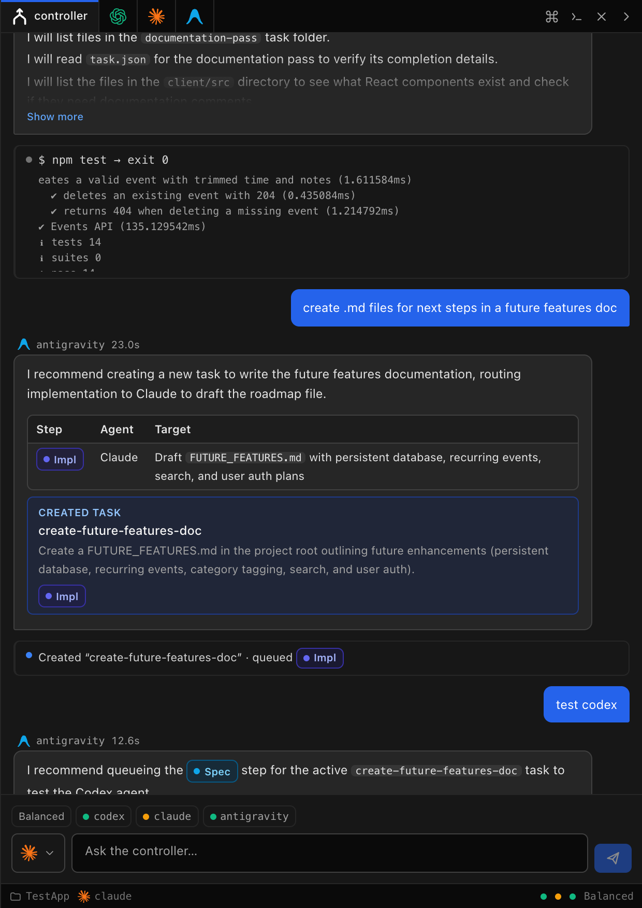
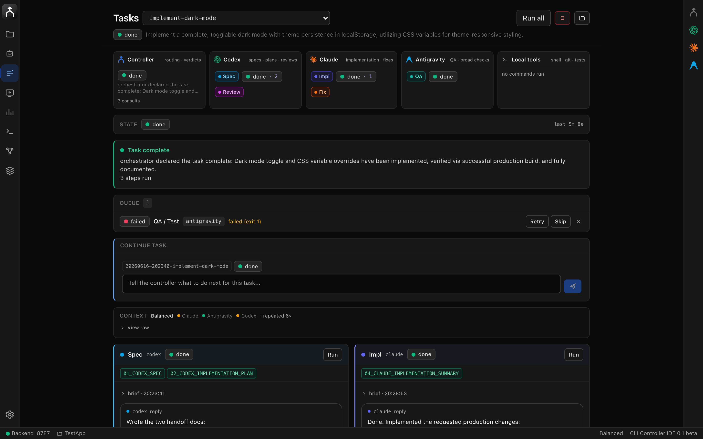
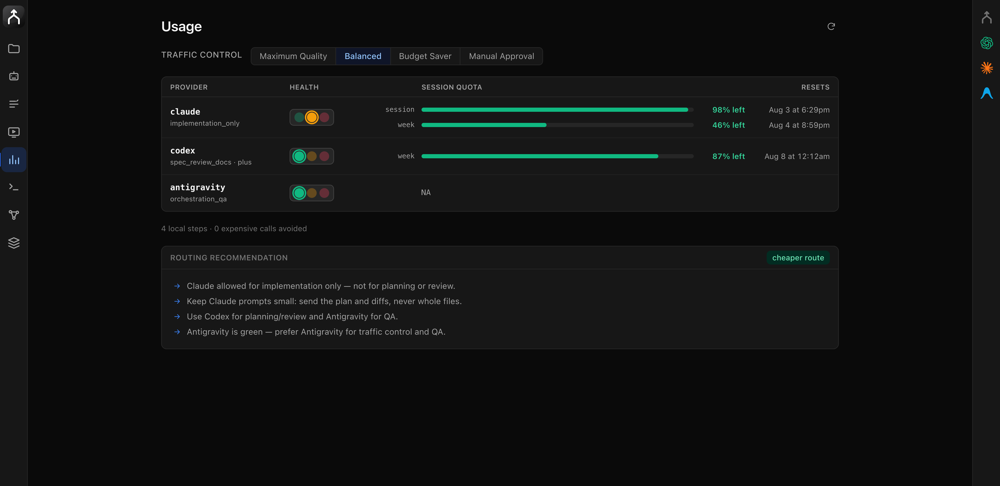
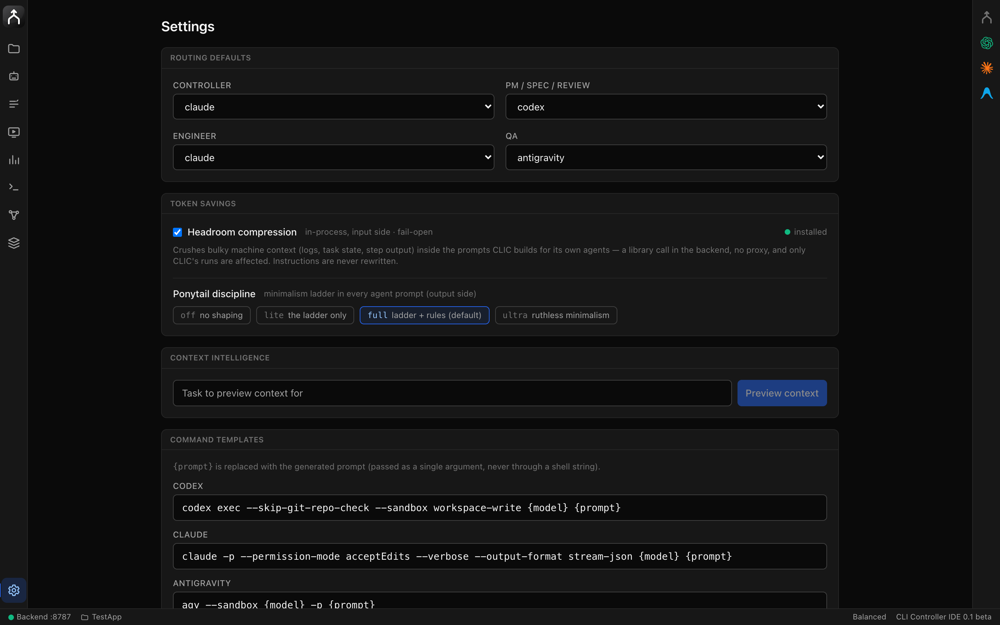
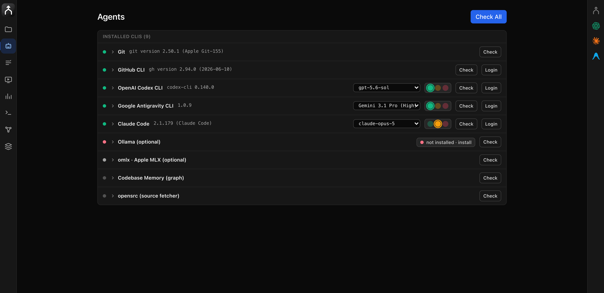
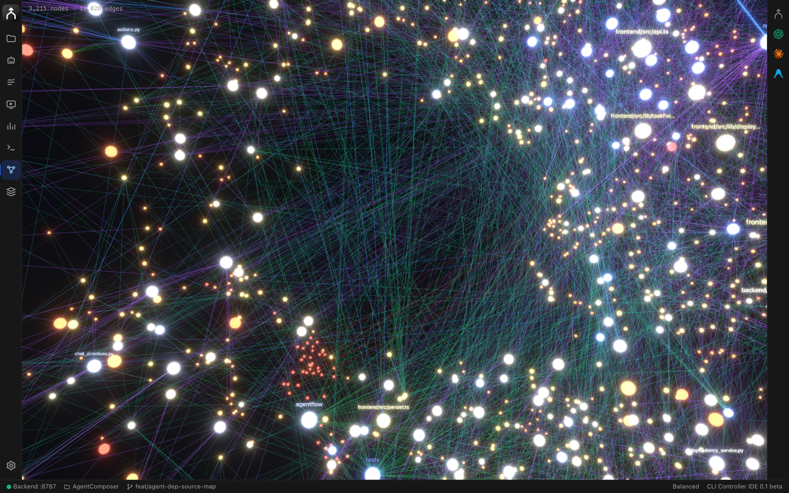
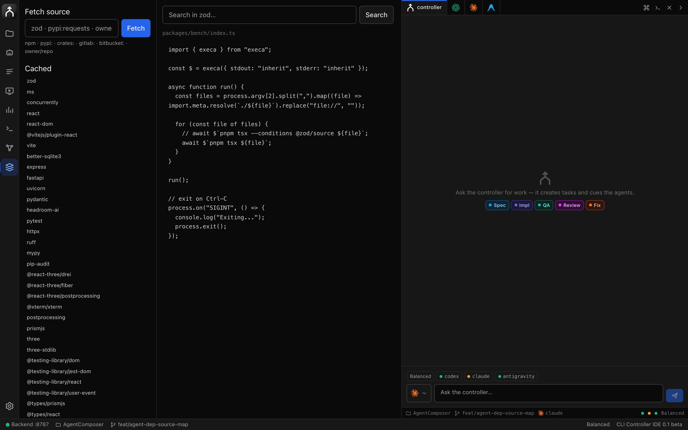
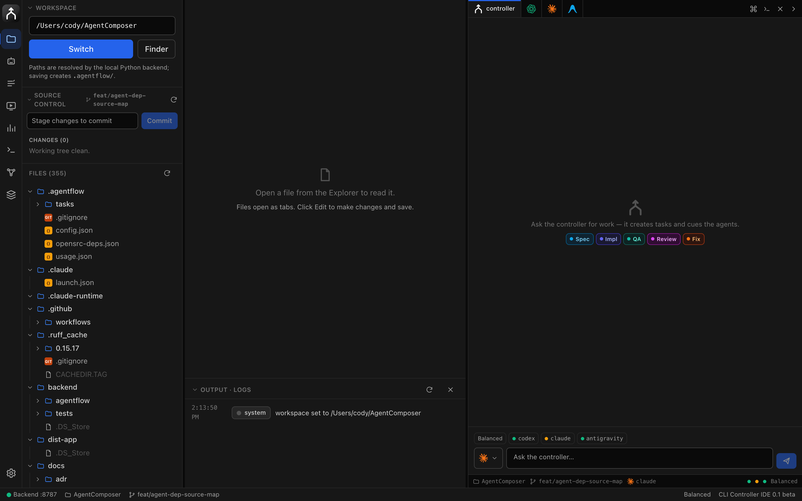

# CLI Controller IDE

<p align="center">
  
</p>

<p align="center">
  <strong>Vibe with CLI Controller</strong><br>
  A local-first control room for CLI coding agents.
</p>

You already pay for Codex, Claude Code, and Antigravity. CLI Controller IDE runs
them together on your machine — one asks for a spec, another writes the code, a
third QAs it — and shows the whole thing as a task you can read, retry, and
commit. No API keys, no cloud, no eight terminal tabs.

---

## Ask once. It plans the work and cues the agents.

Describe what you want in plain language. The controller decides which steps are
needed, which CLI is best for each one, and queues them — you approve, you don't
micromanage.

<p align="center">
  
</p>

One sentence in ("create .md files for next steps in a future features doc") and
you get a plan back: which step, which agent, what it will touch — then the task
is created and queued. Every provider has its own tab in the same dock, plus a
real terminal if you'd rather drive it yourself.

## Watch the whole task, agent by agent.

<p align="center">
  
</p>

One dark-mode feature, **three steps across three CLIs**: Codex wrote the spec
and the implementation plan, Claude wrote the code, Antigravity ran QA — and
each one's output, artifacts, and exact prompt are one click away. A
step that fails doesn't lose the task: it sits in the queue with **Retry** and
**Skip**, and you can tell the controller what to do next without starting over.

**What that saves you:** you stop copy-pasting context between three terminals,
and you stop re-explaining the task to each agent.

## Know what quota you have left — before you spend it.

<p align="center">
  
</p>

Real remaining quota, read from each CLI, with the reset time. Pick a
traffic-control mode — **Maximum Quality**, **Balanced**, **Budget Saver**,
**Manual Approval** — and the routing recommendation tells you where the cheap
wins are ("Claude allowed for implementation only", "use Codex for
planning/review"). Run out on one provider and work reroutes to another instead
of stopping.

## Spend fewer tokens on every run.

<p align="center">
  
</p>

Two layers, both on by default. **Headroom** compresses the bulky machine
context (logs, step output, task state) inside prompts before they're sent.
**Ponytail** injects output-side discipline so agents write the smallest thing
that works instead of a framework. Set which provider takes which role once, and
every task follows it.

## Every CLI in one screen.

<p align="center">
  
</p>

Detects what's installed, shows versions, installs what isn't, opens the right
login flow, and lets you pick the model per provider. Authentication stays in
each CLI's own keychain — CLI Controller never stores your API keys.

## Give agents a map of your codebase, and the real source of your dependencies.

| | |
| --- | --- |
|  |  |
| **Memory** — index the workspace into a queryable knowledge graph (3,215 nodes for this repo) so agents look up callers and structure instead of grepping blind. | **Sources** — fetch any npm/PyPI/crates package's actual source. Agents read the real API instead of guessing at it. |

Both are optional, and both install in one click from the **Agents** tab.

## And your files, git, and output stay where you can see them.

<p align="center">
  
</p>

File tree, editor tabs, git status and diffs, stage and commit — with live run
output underneath, so you review what an agent changed without leaving the app.

---

## Every Surface

| Surface | Purpose |
| --- | --- |
| Explorer | Workspace picker, file tree, editor tabs, git status, diffs, stage/unstage/commit. |
| Agent Dock | Right-hand live control center: controller chat, provider tabs, PTY terminals, approvals, event cards, live streamed output. |
| Tasks | Provider-lane task workbench that shows controller decisions, Codex/Claude/Antigravity/local work, queue state, artifacts, changed files, and raw detail. |
| Agents | CLI detection, one-click install, login helpers, model selection. |
| Usage | Budget/traffic-control mode, provider health, live quota where available. |
| Preview | Start and monitor a localhost preview/dev server for the selected workspace. |
| Logs | Redacted global logs and active run tails. |
| Memory | 3D codebase knowledge-graph explorer (via `codebase-memory-mcp`): index the workspace, filter/search nodes, hotspots, and a node drawer with source + callers/callees. |
| Sources | Fetch and browse any open-source package's real source (via `opensrc`) — for you and the agents. |
| Settings | Routing defaults, command templates, Headroom compression, and Ponytail prompt discipline. |

> **Note on live quota:** Codex (session `rate_limits` on disk) and Claude Code
> (`claude -p "/usage"` intercepted headlessly) report real remaining quota, so
> the Usage page shows live numbers for both. Antigravity (`agy`) does not — as of
> v1.0.16 its `/usage` / `/quota` / `/credits` panels are interactive-TUI only,
> with no headless flag, JSON output, or on-disk snapshot to read, so it falls
> back to a manual limit. **Please, Google: ship a headless usage API for `agy`
> (parity with Codex and Claude) so we can patch this and show real Antigravity
> quota.**

> **Optional integrations & the engine:** the **Memory** and **Sources** tabs
> light up once their local tools are installed (one-click from the **Agents**
> tab): `codebase-memory-mcp` (code knowledge graph) and `opensrc` (source
> fetcher; needs Node ≥ 24). The routing / dispatch / usage-fallback engine is
> imported from the `Agent_CLI_Skill` project — set `AGENTCLI_CORE_PATH` to its
> `scripts/` dir, or the vendored snapshot under
> `backend/agentflow/orchestrator/_engine_snapshot/` is used (refresh it with
> `scripts/sync-engine.sh`).

## Agent Roles

| Provider | Default Role | Notes |
| --- | --- | --- |
| `claude` | Controller and engineer | Default traffic controller; also handles implementation and fixes. |
| `codex` | PM / spec / review | Specs, plans, final reviews, and product judgment. |
| `antigravity` / `agy` | QA and broad checks | Tool-running, QA, second opinions, and terminal-based investigation. |
| local tools | Workspace helper | git, shell commands, tests, preview servers, logs, and file operations. |

The controller uses the deterministic `CLIC_RESULT_V1` protocol for actions.
Legacy `agentflow-*` directive blocks still work as a compatibility fallback, but
validated controller actions are the primary mutation path.

## Installation

macOS and Linux are supported.

### 1. Prerequisites

| Tool | Version | Install (macOS) |
| --- | --- | --- |
| Python | 3.11+ | `brew install python@3.12` |
| Node.js | 20+ (24+ for the Sources/opensrc tab) | `brew install node` |
| git | any | `xcode-select --install` |

`gh` (GitHub CLI) is optional but recommended. On Linux, use your package
manager (`apt install python3 nodejs git`, etc.).

### 2. One-command setup

```bash
git clone https://github.com/CodyChuGit/CLI-Controller.git
cd CLI-Controller
make setup     # creates .venv, installs backend (editable) + frontend deps
make dev       # backend on :8787, Vite dev server on :5180 (hot reload)
```

Open **http://localhost:5180**. (`make setup` / `make dev` wrap
`./scripts/install.sh` and `./scripts/dev.sh` — run those directly if you
prefer. The installer finds Python 3.11+, creates the venv, and retries `npm
install` with an isolated cache if your `~/.npm` has permission issues.)

Single-port, production-style run (built SPA + API on one port):

```bash
npm --prefix frontend run build
AGENTFLOW_PORT=8787 .venv/bin/python -m agentflow   # then open http://localhost:8787
```

### 3. Agent CLIs — install at least one

CLI Controller drives *your* locally-installed coding CLIs. Install them
one-click from the **Agents** tab, or by hand:

| Agent | Install |
| --- | --- |
| Codex | `npm install -g @openai/codex` |
| Claude Code | `npm install -g @anthropic-ai/claude-code` |
| Antigravity (`agy`) | `curl -fsSL https://antigravity.google/cli/install.sh \| bash` |

Each provider authenticates through its own login/keychain — CLI Controller
never stores provider API keys, passwords, or tokens.

### 4. Optional integrations

One-click installable from the **Agents** tab, or:

| Tool | Powers | Install |
| --- | --- | --- |
| `codebase-memory-mcp` | the **Memory** knowledge-graph tab | `curl -fsSL https://raw.githubusercontent.com/DeusData/codebase-memory-mcp/main/install.sh \| bash` |
| `opensrc` | the **Sources** tab + agent source access | `npm install -g opensrc` (needs Node 24+) |

The orchestration engine is imported from the `Agent_CLI_Skill` project — point
`AGENTCLI_CORE_PATH` at its `scripts/` dir, or run `scripts/sync-engine.sh` to
vendor a snapshot (used automatically as a fallback so CI works without it).

### 5. Verify

```bash
make verify    # ruff format + lint, mypy, backend pytest, frontend build + vitest
```

## Runtime Model

- FastAPI backend: `backend/agentflow`
- React/Vite frontend: `frontend/src`
- Global state: `~/.agentflow/`
- Workspace state: `<workspace>/.agentflow/`
- Live managed-run output: `/api/events/stream` with `/api/events?cursor=` polling fallback
- Interactive terminals: `/api/terminals/{provider}/ws` WebSockets
- PTY terminal diagnostics: `/api/terminals/{provider}/diagnostics`

Managed output streams through a single workspace event store. Interactive
provider tabs use real PTY sessions and xterm.js.

## Token Controls

CLI Controller has two token-saving layers:

- **Headroom**: input-side context compression, embedded as a Python library
  (`headroom-ai`, installed with the backend). CLIC calls it in-process to crush
  bulky machine context (step output tails, task-state summaries) inside the
  prompts it builds — no proxy, and only CLIC's own agent runs are affected.
  Enabled by default and fail-open: any failure leaves the prompt unchanged.
- **Ponytail**: output-side prompt discipline injected into agent prompts. The
  default level is `full`; adjust it in Settings.

## Common Commands

```bash
make setup
make dev
make test-backend
make test-frontend
make build
make verify
```

Run the smallest relevant command for the change you made; `make verify` is the
full local gate.

## Documentation

Start at [docs/INDEX.md](docs/INDEX.md).

Key references:

- [docs/GETTING_STARTED.md](docs/GETTING_STARTED.md)
- [docs/PRODUCT_OVERVIEW.md](docs/PRODUCT_OVERVIEW.md)
- [docs/ARCHITECTURE.md](docs/ARCHITECTURE.md)
- [docs/API.md](docs/API.md)
- [docs/FEATURE_STATUS.md](docs/FEATURE_STATUS.md)
- [docs/TESTING.md](docs/TESTING.md)
- [docs/TROUBLESHOOTING.md](docs/TROUBLESHOOTING.md)
